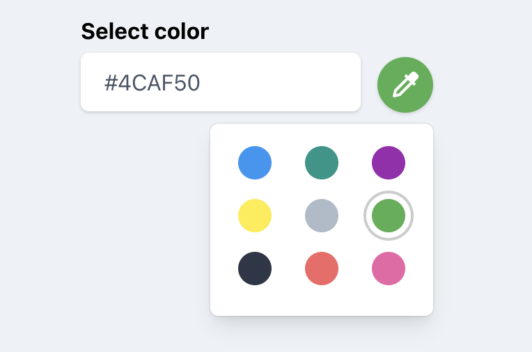

# blade-color-picker

Colorpicker Component Based on alpinejs + blade + tailwindcss

## Requirement

- Laravel
- Tailwindcss
- Alpinejs

## Installation

```
composer require boring-dragon/blade-color-picker
```

## Usage

```blade

<x-boring-dragon::color-picker
    label="Select a color"
    name="color"
    placeholder="Pick a color"
    colorSelected="#2196F3"
    :colors="['#2196F3', '#009688', '#9C27B0', '#FFEB3B', '#afbbc9', '#4CAF50', '#2d3748', '#f56565', '#ed64a6']"
/>

```



Original Component: https://tailwindcomponents.com/component/color-picker-with-tailwindcss-and-alpinejs
